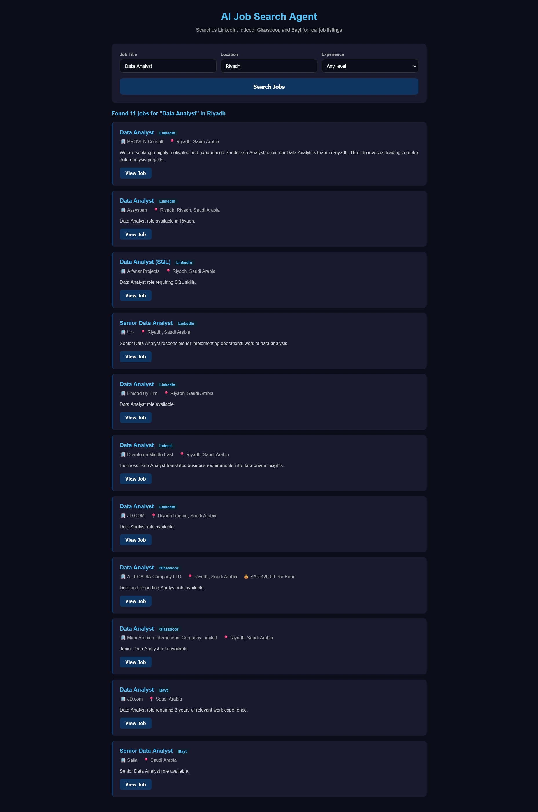

# Job Research AI Agent

An agentic AI tool that searches the web for real job listings using AI powered function calling.

## What It Does

Enter a job title, location, and experience level. The AI agent autonomously searches multiple job platforms including LinkedIn, Indeed, Glassdoor, and Bayt, then returns structured job listings with company details, descriptions, and direct links.

## Tech Stack

| Layer | Technology |
|-------|------------|
| Frontend | React.js, JavaScript (ES6+) |
| Backend | Node.js, Express.js |
| AI | Groq API with Llama 4 Scout (function calling) |
| Web Search | Tavily API |
| Real Time | Server Sent Events (SSE) |

## Note on AI Provider

This project initially used Google Gemini API for function calling. Due to free tier quota limitations and model deprecations, the backend was migrated to Groq API using the meta-llama/llama-4-scout-17b-16e-instruct model, which provides reliable function calling on the free tier.

## Project Structure
job-research-agent/

server/

server.js

.env.example

package.json

client/

src/

App.js

JobResearchAgent.jsx

package.json

## Getting Started

### Prerequisites
- Node.js v18+
- Groq API key (free at console.groq.com)
- Tavily API key (free at tavily.com)

### Installation

Clone the repository:
git clone https://github.com/Hassamkhan9/job-research-agent.git

cd job-research-agent

Install server dependencies:
cd server

npm install

Install client dependencies:
cd ../client

npm install

### Environment Setup

Create a `.env` file in the server folder:
GROQ_API_KEY=your_groq_key_here

TAVILY_API_KEY=your_tavily_key_here

PORT=5000

Get your free Groq API key from console.groq.com
Get your free Tavily API key from tavily.com

### Running the App

Start the server:
cd server

node server.js

Start the React client in a new terminal:
cd client

npm start

Open your browser at http://localhost:3000

## How It Works

1. User enters job title, location, and experience level
2. The Node.js backend sends the query to Groq API with function calling enabled
3. The AI agent autonomously calls the Tavily web search tool to find real job listings
4. Search results stream back to the React frontend via SSE in real time
5. The agent parses the results and returns structured job cards
6. Each job card shows title, company, location, salary, description, and a direct link

## Screenshots

## Environment Variables

| Variable | Description |
|----------|-------------|
| GROQ_API_KEY | Your Groq API key from console.groq.com |
| TAVILY_API_KEY | Your Tavily API key from tavily.com |
| PORT | Server port (default 5000) |

## License
MIT